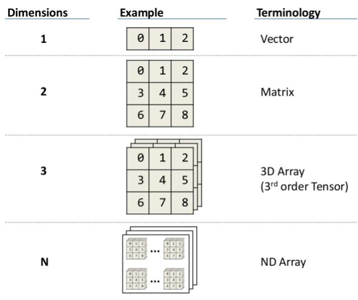
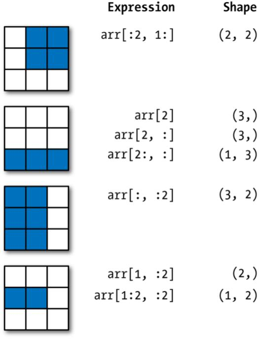
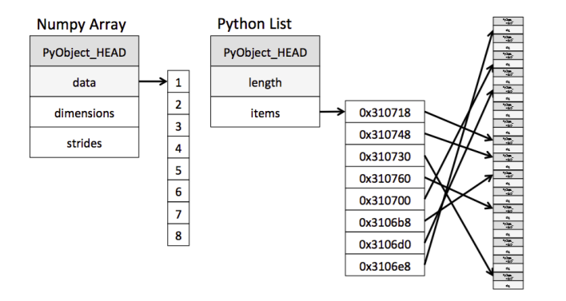
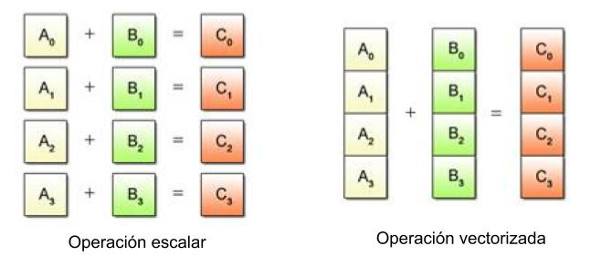
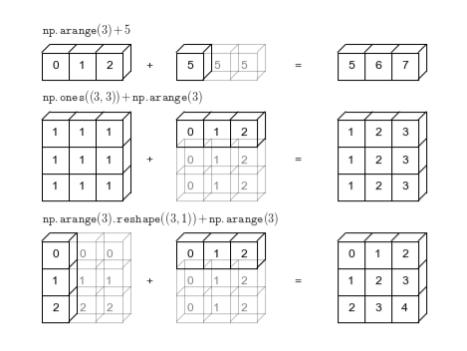
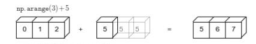
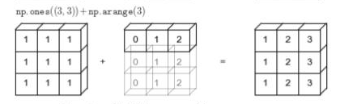
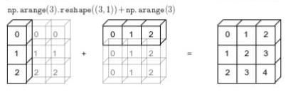

# **Asignatura: Ciencia de Datos**

## **Unidad 1**: Teoría - Librería NumPy

### Objetivos de la clase

- Manipulación de datos con Arrays de NumPy
- Vectorización de operaciones y optimización
- Acceso eficiente a los datos

## ¿Qué es NumPy?

NumPy es el paquete fundamental para la computación científica con Python.

Contiene, entre otras cosas:

- Un poderoso elemento: los arrays de N-dimensiones (ND arrays)
- Funciones para realizar cálculos y operaciones matemáticas con arrays de forma muy eficiente (vectorización)
- Operaciones de álgebra lineal, generación de números aleatorios, entre otras funcionalidades de computación científica

Esto permite que NumPy se integre de manera rápida y sin problemas con una amplia variedad de bases de datos.

## ¿Por qué utilizar arrays?

Un array es una **colección de items de datos**, llamados elementos, asociados a un único nombre de variable.

Diseñados para:

- Facilitar la programación y proveer **buena performance**
- Almacenar y manipular **grandes colecciones de datos**
- Simplificar la tarea de nombrar y referenciar items individuales en una colección de datos
- Permitir la manipulación de una colección entera de datos con una simple sentencia

## ¿Qué es un array?

Un **array** es una estructura de datos que permite agrupar varios valores bajo un único nombre.

**Los elementos de un array son todos del mismo tipo** (a diferencia de las listas de Python).



- Un *vector* es un arreglo **unidimensional**

    ```text
    [0 1 2]
    ```

- Una tabla o *matriz* es un arreglo **bidimensional**

    ```text
    [0 1 2]
    [3 4 5]
    [6 7 8]
    ```

- Por último, un arreglo puede tener **N dimensiones**

  ```text
  1D (vector):     [0 1 2]

  2D (matriz):     [0 1 2]
                   [3 4 5]
                   [6 7 8]

  3D (bloque):     shape (3, 3, 3) → 3 capas de matrices 3×3

                   Capa 0        Capa 1         Capa 2
                   [0 1 2]       [9  10 11]     [18 19 20]
                   [3 4 5]       [12 13 14]     [21 22 23]
                   [6 7 8]       [15 16 17]     [24 25 26]

  ND Array:        shape (d1, d2, ..., dN)
  ```

  En términos matemáticos, un arreglo 3D es un **tensor de orden 3** (*3rd-order tensor*): cada elemento se identifica con 3 índices `(i, j, k)`. En NumPy se suele hablar de *array 3D* o `ndarray` de 3 dimensiones; la palabra *tensor* es más habitual en matemática, física y deep learning.

  > **Nota:** en tensores, *orden* = cantidad de ejes. No confundir con el *rango* de una matriz (número de filas/columnas linealmente independientes). Por eso NumPy usa `ndim` y `shape`.

### `ndim` y `shape`

Todo array de NumPy expone dos atributos que describen su estructura:

- **`ndim`**: número de dimensiones (ejes) del array.
- **`shape`**: tupla con el tamaño en cada eje, de afuera hacia adentro.

```python
import numpy as np

b = np.array([0, 1, 2])
print(b.ndim)    # 1
print(b.shape)   # (3,)

m = np.array([[0, 1, 2],
              [3, 4, 5],
              [6, 7, 8]])
print(m.ndim)    # 2
print(m.shape)   # (3, 3)

a = np.array([[0], [1], [2]])   # vector columna
print(a.shape)   # (3, 1)
```

Siempre se cumple: `len(array.shape) == array.ndim`. Por ejemplo, un array con `shape (3, 3, 3)` tiene `ndim = 3`.

## Creación

La forma más sencilla de construir un array es usando el constructor con un único parámetro:

`numpy.array(object)`

donde object es una colección de elementos

```python
import numpy as np

# Creamos una Lista de python
python_list = [1, 4, 2, 5, 3]

# Creamos un Arreglo (array) de enteros instanciado a partir de una lista:
my_numpy_array = np.array(python_list)

# Imprimimos la lista
print(python_list) # [1, 4, 2, 5, 3]
print(python_list[2]) # 2

# Imprimo el numpy array creado
print(my_numpy_array) # [1 4 2 5 3]
print(my_numpy_array[4]) # 3
```

## Matriz identidad

La **matriz identidad** es una matriz cuadrada con **1** en la diagonal principal y **0** en el resto. En álgebra lineal actúa como el “1” de la multiplicación de matrices: `A @ I = A`.

En NumPy se crea con `np.eye` o `np.identity`.

### `np.eye`

Crea una matriz con unos en la diagonal. Puede ser **cuadrada** o **rectangular**.

```python
import numpy as np

# Matriz identidad 5×5
print(np.eye(5))
# [[1. 0. 0. 0. 0.]
#  [0. 1. 0. 0. 0.]
#  [0. 0. 1. 0. 0.]
#  [0. 0. 0. 1. 0.]
#  [0. 0. 0. 0. 1.]]

# Matriz rectangular 4 filas × 5 columnas (unos en la diagonal)
print(np.eye(4, 5))
# [[1. 0. 0. 0. 0.]
#  [0. 1. 0. 0. 0.]
#  [0. 0. 1. 0. 0.]
#  [0. 0. 0. 1. 0.]]
```

**Sintaxis:** `np.eye(N, M=None)` — `N` filas; si no se pasa `M`, es cuadrada (`N×N`).

### `np.identity`

Crea **solo** matrices cuadradas (`N×N`). Es equivalente a `np.eye(N)`.

```python
print(np.identity(5))
# [[1. 0. 0. 0. 0.]
#  [0. 1. 0. 0. 0.]
#  [0. 0. 1. 0. 0.]
#  [0. 0. 0. 1. 0.]
#  [0. 0. 0. 0. 1.]]
```

### `eye` vs `identity`

| Función | Cuadrada | Rectangular | Uso típico |
|---------|----------|-------------|------------|
| `np.eye(N)` | Sí | — | Identidad `N×N` |
| `np.eye(N, M)` | — | Sí | Diagonal en matriz `N×M` |
| `np.identity(N)` | Sí | No | Solo identidad `N×N` |

> En la práctica se usa más `np.eye`, porque cubre el caso cuadrado y el rectangular.

[Ver Documentación - eye](https://numpy.org/doc/stable/reference/generated/numpy.eye.html)

[Ver Documentación - identity](https://numpy.org/doc/stable/reference/generated/numpy.identity.html)

## Acceso

Los arreglos se indexan desde 0 hasta len(a) - 1

`a[0]` devuelve el valor de la primera posición del arreglo

`a[len(a)-1]` devuelve el valor de la última posición del arreglo

```python
# visualizamos el primer elemento
print(my_numpy_array[0])

# ahora el segundo elemento
print(my_numpy_array[1])

# y el último elemento
print(my_numpy_array[len(my_numpy_array)-1])
```

## Selección de elementos: indexing & slicing



### Tipos de indexing

Llamamos “indexing” al proceso de acceder a los elementos de un array con algún criterio.

Existen tres tipos de indexing en Numpy:

- **Slicing**: cuando accedemos a los elementos con los parámetros start,stop,step: `my_array[0:5:-1]`

- **Fancy Indexing**: Cuando creamos una lista de índices y la usamos para acceder a ciertos elementos del array: `my_array[[3,5,7,8]]`

- **Boolean Indexing**: Cuando creamos una “máscara booleana” (un array o lista de True y False) para acceder a ciertos elementos: `my_array[my_array > 4]`

### Tipos de indexing - Slicing

````python
import numpy as np

one_d_array = np.arange(10)
print(one_d_array)

# Start = 1: con esto comenzamos por el segundo elemento
# Stop: Al no estar definido, llegamos hasta el final.
# Step: El paso o distancia entre los elementos es 2.
print(one_d_array[1::2])

# Start: Al no estar definido, entonces comenzamos desde el primero.
# Stop: Al no estar definido, entonces llegamos hasta el final.
# Step = -1, me permite invertir el orden del array
print(one_d_array[::-1])
````

#### np.arange — crear secuencias numéricas

`numpy.arange` crea un array **unidimensional** con valores **equiespaciados** en un rango. Es el equivalente en NumPy de `range()` de Python, pero devuelve un `ndarray`.

**Sintaxis:**

```python
np.arange(stop)
np.arange(start, stop)
np.arange(start, stop, step)
```

- **`start`**: valor inicial (por defecto `0`).
- **`stop`**: valor final (**no se incluye**).
- **`step`**: distancia entre valores (por defecto `1`).

[Ver Documentación - arange](https://numpy.org/doc/stable/reference/generated/numpy.arange.html)

### Tipos de indexing - Fancy Indexing

````python
import numpy as np

# Límite inferior del rango de valores aleatorios (se incluye)
low = 0
# Límite superior del rango (no se incluye): intervalo [0, 10)
high = 10
# Forma del array: 3 filas × 4 columnas
size = (3, 4)

# Crea un generador aleatorio moderno de NumPy
# (sin semilla → valores distintos en cada ejecución)
random_generator = np.random.default_rng()
# random_generator = np.random.default_rng(42)  # con semilla fija → siempre los mismos números

# Genera una matriz 3×4 con valores float distribuidos
# uniformemente en el intervalo [low, high)
two_d_array = random_generator.uniform(low, high, size)

# Muestra el array generado (en notebook o consola interactiva)
two_d_array

# Fancy indexing por filas: seleccionamos las filas 0, 2, 1 y repetimos la 0
lista_indices_filas = [0, 2, 1, 0]
two_d_array[lista_indices_filas]

# Fancy indexing por columnas: todas las filas (:),
# columnas 2, 3, 1 y repetimos la 2
lista_indices_columnas = [2, 3, 1, 2]
two_d_array[:, lista_indices_columnas]
````

[Ver Documentación - Fancy Indexing](https://numpy.org/doc/stable/user/basics.indexing.html#advanced-indexing)

[Ver Documentación - default_rng](https://numpy.org/doc/stable/reference/random/generator.html#numpy.random.default_rng)

[Ver Documentación - uniform](https://numpy.org/doc/stable/reference/random/generated/numpy.random.Generator.uniform.html)

### Tipos de indexing - Boolean Indexing

````python
import numpy as np

# Array 1D de ejemplo: [0 1 2 3 4 5 6 7 8 9]
one_d_array = np.arange(10)

# Máscara booleana: True donde el elemento es múltiplo de 3
# % es el operador módulo (resto de la división)
mask_pair_number = one_d_array % 3 == 0
print(mask_pair_number)  # [True False False True False False True False False True]

# Boolean indexing: devuelve solo los elementos donde la máscara es True
print(one_d_array[mask_pair_number])  # [0 3 6 9]

# Matriz 2D aleatoria 3×4 con valores en [0, 10)
two_d_array = np.random.default_rng().uniform(0, 10, (3, 4))

# Máscara booleana: True donde el valor es mayor que 5
mask_great_5 = two_d_array > 5
print(mask_great_5)  # matriz 3×4 de True/False

# Devuelve un array 1D solo con los valores que cumplen la condición
print(two_d_array[mask_great_5])
````

## Vectorización

Los arrays de NumPy son estructuras **mucho más eficientes** para operar sobre datos que las listas de Python. En lugar de procesar elemento por elemento con bucles, NumPy aplica la operación **de una vez sobre todo el array**.

Esto se debe, en parte, a que en un NumPy array el **tipo de dato es fijo** (por ejemplo, todos `int64` o todos `float64`). Eso permite almacenar los valores en memoria de forma compacta y ejecutar operaciones optimizadas en C, sin la sobrecarga de Python por cada elemento.



- Las operaciones vectorizadas trabajan sobre los datos **como un bloque**.
- Es necesario que los tipos sean **homogéneos** entre todos los elementos.
- En una operación vectorizada, **no recorremos** los elementos uno a uno con `for`.



### Ejemplos sencillos

#### 1. Sumar dos colecciones

Con listas de Python hay que iterar (o usar una list comprehension):

```python
a = [1, 2, 3, 4]
b = [10, 20, 30, 40]

# Recorremos índice por índice
c = [a[i] + b[i] for i in range(len(a))]
print(c)  # [11, 22, 33, 44]
```

Con NumPy, una sola línea aplica la suma a **todos** los pares de elementos:

```python
import numpy as np

a = np.array([1, 2, 3, 4])
b = np.array([10, 20, 30, 40])

c = a + b
print(c)  # [11 22 33 44]
```

#### 2. Aplicar la misma operación a todos los valores

Calcular un 10 % de descuento sobre una lista de precios:

```python
precios = np.array([100, 250, 80, 320])

# Multiplica cada precio por 0.9, sin usar un bucle
precios_con_descuento = precios * 0.9
print(precios_con_descuento)  # [ 90. 225.  72. 288.]
```

#### 3. Evaluar una condición sobre todo el array

Filtrar temperaturas por encima de 20 °C:

```python
temperaturas = np.array([-2, 15, 32, 5, 28, 21])

# Genera una máscara booleana y filtra en una sola expresión
calor = temperaturas[temperaturas > 20]
print(calor)  # [32 28 21]
```

#### 4. Aplicar una función matemática a cada elemento

```python
valores = np.array([4, 9, 16, 25])

raices = np.sqrt(valores)  # raíz cuadrada de cada elemento
print(raices)  # [2. 3. 4. 5.]
```

### Idea clave

| Enfoque           | Cómo opera                     | Ejemplo                  |
|-------------------|--------------------------------|--------------------------|
| Lista + bucle     | Un elemento a la vez en Python | `[x * 2 for x in lista]` |
| NumPy vectorizado | Toda la colección a la vez     | `array * 2`              |

La vectorización hace el código **más corto, más legible y más rápido**, especialmente con grandes volúmenes de datos.

## Broadcasting

NumPy tiene un conjunto de reglas para aplicar operaciones **miembro a miembro** en arrays de **diferente tamaño**.

Se **proyectan** (estiran) los valores de los arrays más pequeños para poder operar sobre los mismos, sin copiar datos de forma explícita.



El broadcasting en NumPy sigue un conjunto estricto de reglas para determinar la interacción entre dos arrays:

### Regla 1

Si los dos arrays difieren en su número de dimensiones, la forma del que tiene **menos dimensiones** se rellena con unos en su lado delantero (**izquierdo**).

Ejemplo: un array de forma `(3,)` frente a uno de forma `(3, 3)` se interpreta como `(1, 3)`.

### Regla 2

Si la forma de los dos arrays no coincide en alguna dimensión, el array con forma igual a **1** en esa dimensión se **estira** para que coincida con la otra.

Ejemplo: `(1, 3)` frente a `(3, 3)` → el primero se estira a `(3, 3)`.

### Regla 3

Si en alguna dimensión los tamaños son diferentes y **ninguno es igual a 1**, se genera un **error**.

Ejemplo: `(2, 3)` y `(3, 2)` no son compatibles → `ValueError`.

### Ejemplos

#### 1. Escalar + array 1D

El escalar `5` se proyecta a lo largo del array `[0, 1, 2]`:



```python
import numpy as np

# Reglas 1 y 2: el escalar se estira a shape (3,) → [5, 5, 5]
resultado = np.arange(3) + 5
print(resultado)  # [5 6 7]
```

#### 2. Matriz 2D + array 1D

El array `[0, 1, 2]` se estira en vertical para sumarse a una matriz de unos 3×3:



```python
# Regla 1: (3,) → (1, 3)
# Regla 2: (1, 3) se estira a (3, 3)
resultado = np.ones((3, 3)) + np.arange(3)
print(resultado)
# [[1. 2. 3.]
#  [1. 2. 3.]
#  [1. 2. 3.]]
```

#### 3. Vector columna + vector fila

Ambos arrays se estiran: uno en horizontal y el otro en vertical, hasta forma `(3, 3)`:



```python
# Izquierda: (3, 1) se estira en columnas → [[0,0,0], [1,1,1], [2,2,2]]
# Derecha:   (3,) → (1, 3) se estira en filas → [[0,1,2], [0,1,2], [0,1,2]]
resultado = np.arange(3).reshape((3, 1)) + np.arange(3)
print(resultado)
# [[0 1 2]
#  [1 2 3]
#  [2 3 4]]
```

#### 4. Caso incompatible (Regla 3)

```python
a = np.ones((2, 3))
b = np.ones((3, 2))
# a + b  → ValueError: operands could not be broadcast together
```

[Ver Documentación - Broadcasting](https://numpy.org/doc/stable/user/basics.broadcasting.html)
